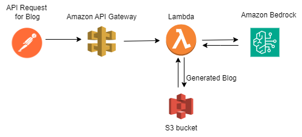

### Project: 
To generate a blog for the User topic with Titan Text G1 - Express Model that runs on the Amazon Bedrock. The user topic will be passed as a POST API request (via postman) to a Lambda function as a trigger through Amazon API Gateway. The generated blog will be saved as a text file in S3 Bucket.

### 🛠️ Tech Stack:
1. Postman (for POST API Request), 
2. Amazon API Gateway 
3. Lambda Function
4. Python 3.12.
5. Titan Text G1 Express Model (Amazon Bedrock)
6. S3 Bucket
7. Cloudwatch Logs for Monitoring

### Prerequisites
#### Environment Setup

1. **Create a Virtual Environment using pip:**
   ```bash
   python -m venv awsbedrock
   ```   
2. **Activate the Virtual Environment:**
   ```bash
     awsbedrock\Scripts\activate.bat
   ```
3. **Install Requirements:**
   ```
   pip3 install -r requirements.txt
   ```
      
### Project Architecture:




