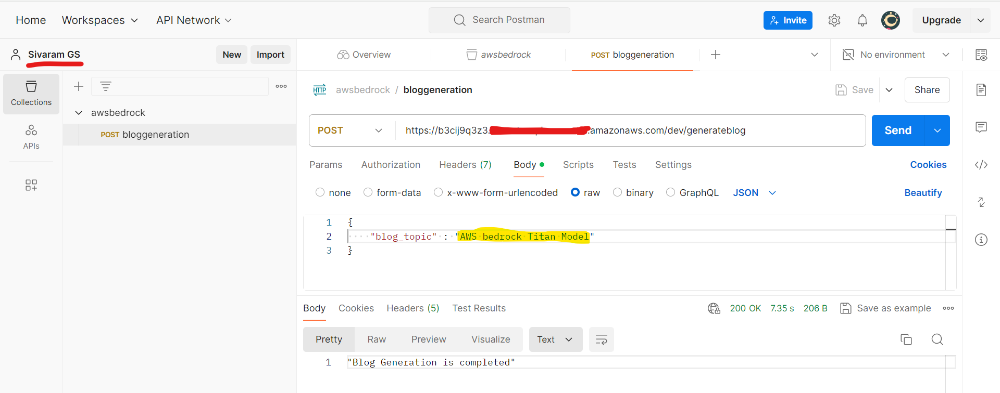
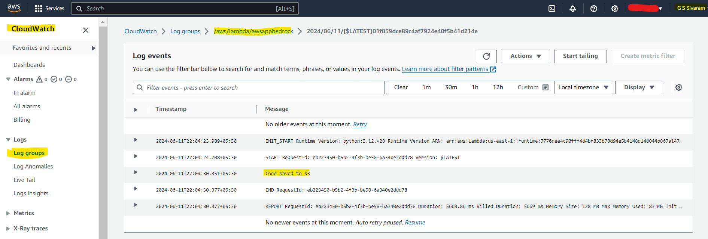

### Project: 
To generate a blog for the User topic with Titan Text G1 - Express Model that runs on the Amazon Bedrock. The user topic will be passed as a POST API request (via postman) to a Lambda function as a trigger through Amazon API Gateway. The generated blog will be saved as a text file in S3 Bucket.

### 🛠️ Tech Stack:
1. Postman (for POST API Request), 
2. Amazon API Gateway 
3. Lambda Function
4. Python 3.12.
5. Titan Text G1 Express Model (Amazon Bedrock)
6. S3 Bucket
7. Cloudwatch Logs for Monitoring

### Prerequisites
#### Environment Setup

1. **Create a Virtual Environment using pip:**
   ```bash
   python -m venv awsbedrock
   ```   
2. **Activate the Virtual Environment:**
   ```bash
     awsbedrock\Scripts\activate.bat
   ```
3. **Install Requirements:**
   ```
   pip3 install -r requirements.txt
   ```
      
### Project Architecture:


### Work Done:

1. Requested and got the access granted for Titan Text G1 Express Model in Amazon Bedrock.


2. Noted model id and API request for Titan Text G1 Express in Amazon Bedrock.


3. Created a API Gateway to trigger AWS lambda function and added route to make a POST API request.


4. Written the python code to invoke Titan Text G1 Express model for blog generation of user topic. Added layer to use latest boto3 library. 


5. Made a POST API request from POSTMAN to API gateway endpoint to trigger the AWS lambda function for blog generation. Passed the User topic in the body of request parameter.


6. Monitored the cloudwatch logs of the AWS lambda function and fixed the errors raised. Verified the success message "code saved to S3". 


7. Saved the generated blog as a text file in S3 bucket.

